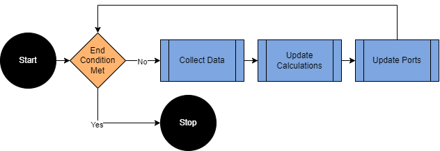

# lucullus_rest

Everything related to accessing the REST API of Lucullus with Python.

## Installation

Download the repository from [github](https://github.zhaw.ch/BPT/lucullus_rest) and install it in a folder on your path. For this either
  * add the folder to your system path,
  * or add the files into the folder "site-packages" where your Python installation resides.

To function the following libraries are needed:
  * numpy
  * pandas
  * requests
  * datetime

The libaries can be installed using the pip command in your command window:
```
pip install numpy
```

## Usage

### Basic usage

To use lucullus_rest, simply start python and import it via the import command.

```python
import lucullus_rest
```

If you would like to export and save process data use the 'export_to_df' function:

```python
from lucullus_rest.core import export_to_df

auth = ("user", "password")
process = "Process_555"
port_names = ["PV_pO2", "PV_Temp"]
save_path = r"C:Users/User/Documents/process_data.xlsx"

df = export_to_df(process, port_names, auth)
df.to_excel(save_path)
```

Please note at this point that export_to_df will only work on ports that are being logged. When trying export_to_df on ports that are not logged, the status code of the request will be 500.

Just as easily you can access the information on media used for this process

```python
from lucullus_rest.core import get_media_table

auth = ("user", "password")
process = "Process_555"

df = get_media_table(process, auth)
df.to_excel(save_path)
```

You can also get the recipe of a medium in a similar fashion:

```python
from lucullus_rest.core import get_recipe_table

auth = ("user", "password")

df = get_recipe_table("YEP", auth)
df.to_excel(save_path)
```

### The Controller class

What is more, the lucullus_rest library also allows for easy 
creation of controllers using the 'Controller' class.



There are four main components of a controller:
  1. A list of Lucullus ports. 
  2. Optional: A calculation function. The calculation function takes
    the collected and calculated data as inputs and returns a pandas
    dataframe of the calculated data.
  3. Optional: An output function. The output function returns a
    dictionary of the ports that should be updated after each cycle.
  4. Optional: A condition function. The end condition function returns
    True if the cycle should continue, and False if the update cycle
    should end.

In the following example the three main components are the following:
  1. We import the process values of ports "PV_O2", and "PV_AirFlow".
  2. From those two values, we calculate the oxygen uptake rate in g/min.
  3. If the oxygen uptake rate is higher than a threshold value, set the temperature to 20 °C.

```python
from lucullus_rest.core import Controller

auth = ("user", "password")
process = "Process_555"
port_names = ["PV_O2", "PV_AirFlow"]

def calc_rO2(collected_data, calculated_data):
    rO2 = collected_data["PV_AirFlow"]*(21-collected_data["PV_O2"])/100/22.41*32

    calculated_data = pd.DataFrame({
        "Calc_rO2": rO2,
    })
    return calculated_data

def update_temp(collected_data, calculated_data):
    current_rO2 = calculated_data["Calc_rO2"].values[-1]
    if current_rO2 > 10:
        updated_ports = {"SP_Temp": 20}
    else:
        updated_ports = {}
    return updated_ports

c = Controller(process, port_names, auth, 
    interp_interval=60,
    update_interval=30,
    calc_fun=calc_temp_integral,
    output_fun=update_temp
)
```

After creation of the controller, we can check perform some basic checks by calling the 'function_test' function:

```python
c.function_test()
```

We start the update cycle with the following command:

```python
c.start_update_cycle()
```

More detailed documentation about the logic behind the 
lucullus_rest library can be found as jupyter notebooks in the 
docs folder.

### Guidelines for creating your own controller

Creation of your own controller class could look something like this:

```python
from lucullus_rest.core import Controller

class MyPersonalController(Controller):
    """Description of MyPersonalController."""

    def __init__(self, process, auth):

        needed_ports = ["Port1", "Port2"]

        super().__init__(
            process,
            needed_ports,
            auth,
            calc_fun = _my_calc_fun,
            output_fun = _my_update_fun,

        )
        return

    @staticmethod
    def _my_calc_fun(collected_data, calculated_data):
        return calculated_data

    @staticmethod
    def _my_update_fun(collected_data, calculated_data):
        return updated_ports
```

In this example, there is only the __init__ function, which defines the needed ports and builds the controller. All other methods are static methods, i.e., they do note access any class attributes directly. This allows us to easily verifying the functionality of everything as a whole:
  1. The functionality of the controller class is guaranteed by the tests for the general controller class.
  2. The functionality of the specific controller class can be guaranteed by creating unit tests for the static methods.

### Further Information

More examples of use cases or controllers can be found in this repository under /docs/examples as Jupyter notebooks.


Please note, that those tests only test for the function of the general controller class, but not a specific one. To be sure that those will function as intended, specific unit tests should be written and run.

## Roadmap

1. Add Controllers into library which should inlcude
    - Softsensor for volume based on scales.
    - Softsensor for biomass based on offgas measurements.
    - Signal fusion for fusing atline and online measurements.
2. Add tests for checking functionality.

## Support and Contribution

If you have questions, suggestions, or want to contribute, just write me per mail at hatr@zhaw.ch.

## License

[MIT](https://choosealicense.com/licenses/mit/)